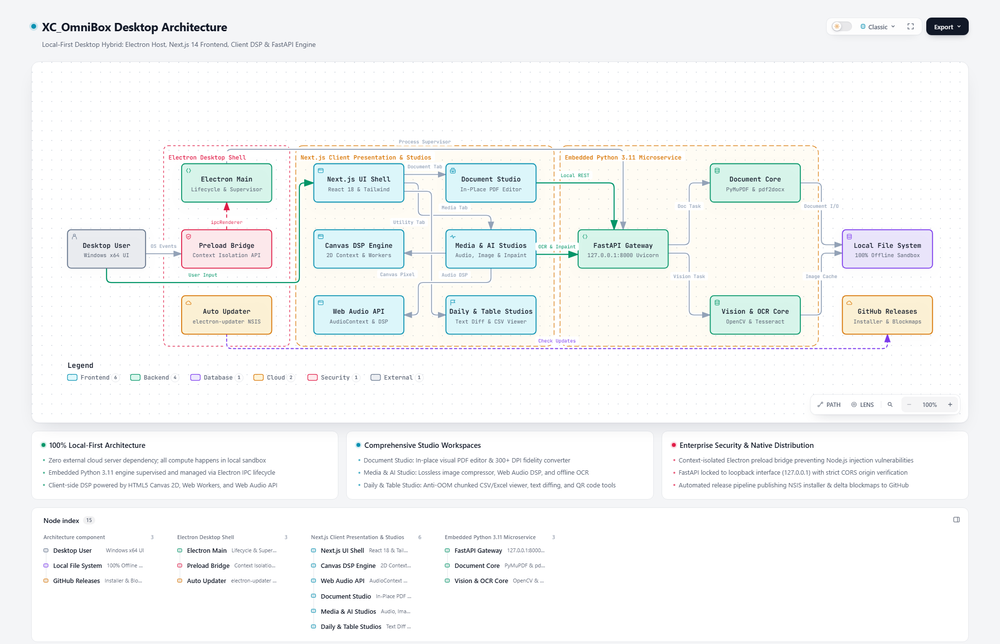

# XC_OmniBox (XC 万象箱)

<p align="center">
  <strong>全能多媒体创作效率桌面工具箱 / Fast Local-First Desktop Toolbox & Multimedia Suite</strong>
</p>

<p align="center">
  <a href="README.md">English</a> | <strong>简体中文</strong> | <a href="USER_MANUAL.md">📖 用户手册</a> | <a href="CHANGELOG_ZH.md">📋 更新日志</a>
</p>

<p align="center">
  <a href="https://github.com/LEESC88/XC_OmniBox/releases/latest">
    
  </a>
  <a href="https://github.com/LEESC88/XC_OmniBox/blob/main/LICENSE">
    
  </a>
  
  
  
</p>

---

## 📖 简介 (Overview)

**XC_OmniBox (XC 万象箱)** 是一款基于 **Electron**、**Next.js 14 (React 18)** 与内置 **FastAPI (Python 3.11 混合计算引擎)** 构建的高性能本地多媒体与办公效率桌面软件。

专为内容创作者、开发者与日常办公人士设计，秉持四大核心技术理念：
- 🛡️ **100% 本地纯离线运算**：零云端服务器上传、零外部 API 依赖、零隐私遥测。所有数据操作均严格在本地隔离沙盒内完成。
- ⚡ **零延迟即时响应**：内置内存级零拷贝管道、GPU 加速 Canvas 渲染与前端 Web Audio API，参数调节与效果对比毫秒级实时可见。
- 🚀 **极速冷启动与瞬切**：UI 窗口 300 毫秒内瞬时呈现，搭载 120 FPS Keep-Alive 存活驻留架构，跨工具切换不销毁状态、工作流无中断。
- 🗂️ **全能专业级工坊合集**：集成了文档 PDF、图片视觉、表格数据、音频声学、日常便民与 AI 视觉工坊，统一采用高质感企业级微曲设计。

---

## 🏗️ 系统架构图 (System Architecture)

本项目架构图基于 [Archify](https://github.com/tt-a1i/archify) 自动化构建与验证：

<p align="center">
  <picture>
    <source media="(prefers-color-scheme: dark)" srcset="docs/assets/architecture-dark.png" />
    
  </picture>
</p>

<p align="center">
  <a href="docs/architecture.html"><strong>🔍 查看可交互式架构大图 (HTML 独立版)</strong></a>
</p>

### 架构层级解析

1. **桌面宿主层 (`Electron Host`)**：
   - 管理原生操作系统窗口、应用生命周期与基于 `preload.js` 的 Context Isolation 安全隔离桥。
   - 运行进程守护器，负责后台静默拉起与监控独立的本地 Python FastAPI 混合微服务。
   - 集成 `electron-updater`，通过 GitHub Releases 提供自动差分热更新。

2. **前端呈现与客户端 DSP 层 (`Next.js 14 + React 18`)**：
   - 现代化多工坊 Tab 路由容器，搭载微曲双色调图标与独立深浅色自适应主题系统。
   - 客户端 Web Audio API (`AudioContext`, `BiquadFilter`, `GainNode`) 承载零延迟音频滤镜与即时 A/B 试听。
   - HTML5 Canvas 2D 与 Web Workers 提供 4-邻域 BFS 漫水抠图、文字对比与图像像素运算。

3. **内置 Python 3.11 独立微服务 (`FastAPI + PyInstaller`)**：
   - 独立打包的冷冻可执行文件 (`omni-backend.exe`)，严格仅监听本地回环地址 `127.0.0.1:8000` 并通过 CORS 鉴权。
   - 调度高负荷文档计算库（**PyMuPDF / fitz**、**python-docx**、**pdf2docx**），实现 300+ DPI 超高保真转换与 PDF 原位编辑。
   - 提供基于 **OpenCV**、**Pillow** 与 **Tesseract OCR** 的离线图像处理与文本识别能力。

---

## ✨ 核心工坊功能全景 (Features Matrix)

### 📄 1. PDF 与文档工坊 (Document & PDF)
- **PDF 原位所见即所得编辑器**：无需转格式，直接在原版面就地改字、高亮标注、遮盖涂抹、签名插入，绝不破坏原有排版排版。
- **Word / PDF 双向超保真转换**：提供多档位分辨率（96, 150, 300+ DPI 打印级），独创字体流裁剪算法杜绝体积虚增。
- **PDF 页面与安全管理**：多文档拖拽合并、按页拆分、动态防伪半透明水印与 AES 加密保护。

### 🖼️ 2. 图片与视觉工坊 (Image & Visual)
- **视觉无损图片压缩**：智能压缩算法最高节约 90% 存储，支持 Squoosh 级交互式分屏微距滑动画质比对。
- **Apple HEIC 转码大师**：批量转换 iPhone 实况照片与 HEIC 为 JPG/PNG/WebP，搭载防 OOM 内存保护。
- **等比批量缩放与格式转换**：支持留白与裁切两种等比安全模式，杜绝拉伸变形；一键清除拍摄 EXIF 隐私。

### 📊 3. 表格工坊 (Spreadsheet Studio)
- **多工作表智能拼接 (Sheet Merge)**：自动匹配表头字段并对齐合并多个 Excel/CSV，支持行级去重与数据来源追溯。
- **单表按分类拆分 (Sheet Split)**：上传超大汇总表，按部门/城市等字段秒级拆分为独立表格并打包 ZIP。
- **防 OOM 内存保护与多 Sheet 检测**：异步探测分组基数预警，自适应 1~5 行跨列复杂报表表头。

### 🎵 4. 音频与声学工坊 (Audio & Acoustic)
- **高精度音频剪辑**：Pointer Capture 锁定光标防止边界脱靶，无缝循环试听。
- **多音轨拼接**：支持拖拽追加多段音频，提供独立单轨试听与格式对齐拼接。
- **0%~300% 增益调节与实时 A/B 对比**：支持音量减小与强力放大，毫秒级切换对比原声与效果音。
- **卡拉OK伴奏提取**：立体声中央声道相位抵消消人声，支持低频鼓点保护与单声道拦截。
- **视频提纯音频**：支持常见视频格式，一键吸附当前播放点打点截取。

### 🗂️ 5. 日常生活与实用工具 (Daily Utilities)
- **文章对比 (Text Diff)**：双栏内联流式排版，按词高亮增删变动与字数统计。
- **证件照智能排版与漫水换底**：标准一寸/小二寸/二寸自适应换底（红白蓝灰），4-邻域 BFS 保护浅色衣物，自动拼版 6 寸相纸。
- **个性化艺术二维码**：自定义渐变色与中心 Logo，强制保护三大 7×7 寻象定位角；支持直接 `Ctrl+V` 粘贴图片解码。
- **目录智能归类防碰撞**：按类型或修改年月时间轴整理文件夹，提供无损试运行预演清单。
- **重复文件极速排重**：三级阶梯短路哈希引擎，支持自定义保留原件并安全移入系统回收站。

### 🤖 6. AI 创意工坊 (AI Studio)
- **AI 智能消除笔 (Inpaint Brush)**：涂抹消除画面杂物，Alpha 通道保护透明 PNG 不变黑。
- **双层可搜索全彩 PDF**：扫描件 OCR 识别，底层生成透明文字图层，保持原始全彩高保真画质。
- **断句字幕工坊**：本地语音活性检测 (VAD) 自动切分语音区间，支持单句精准试听截断与 SRT 导出。

---

## 🚀 下载与安装 (Download)

### 预编译安装包 (Windows x64)

前往 [GitHub Releases](https://github.com/LEESC88/XC_OmniBox/releases/latest) 下载最新版安装包：
- **`XC_OmniBox-Setup-1.5.4.exe`**

*软件内置自动更新功能，发布新版本时将自动在客户端右下角推送通知。*

---

## 🛠️ 本地开发环境搭建 (Development)

### 前置要求
- **Node.js** 18+ & **npm**
- **Python** 3.11+
- **Windows** 10 / 11

### 1. 克隆代码仓库
```bash
git clone https://github.com/LEESC88/XC_OmniBox.git
cd XC_OmniBox
```

### 2. 安装前端与 Electron 依赖
```bash
npm install
npm --prefix frontend install
```

### 3. 配置 Python 后端环境
```bash
cd backend
python -m venv venv
venv\Scripts\activate
pip install -r requirements.txt
cd ..
```

### 4. 运行本地开发
```bash
# 桌面全量开发环境 (前端 Next.js + 后端服务 + Electron 宿主)
npm run dev:electron

# 纯 Web 浏览器运行模式 (http://localhost:3000)
npm run dev
```

### 5. 打包构建
```bash
# 前端静态打包
npm run build:frontend

# 完整打包发布 Windows 安装包 (.exe)
npm run dist
```

---

## 📋 版本历史与发行日志 (Release Logs)

每次发布的详细日志已独立归档：
- 🌐 [English Changelog (CHANGELOG.md)](CHANGELOG.md)
- 🇨🇳 [中文版本历史更新日志 (CHANGELOG_ZH.md)](CHANGELOG_ZH.md)

---

## 📜 开源协议 (License)

本项目基于 [MIT License](LICENSE) 开源。欢迎提交 Issue 与 Pull Request 共同完善！
